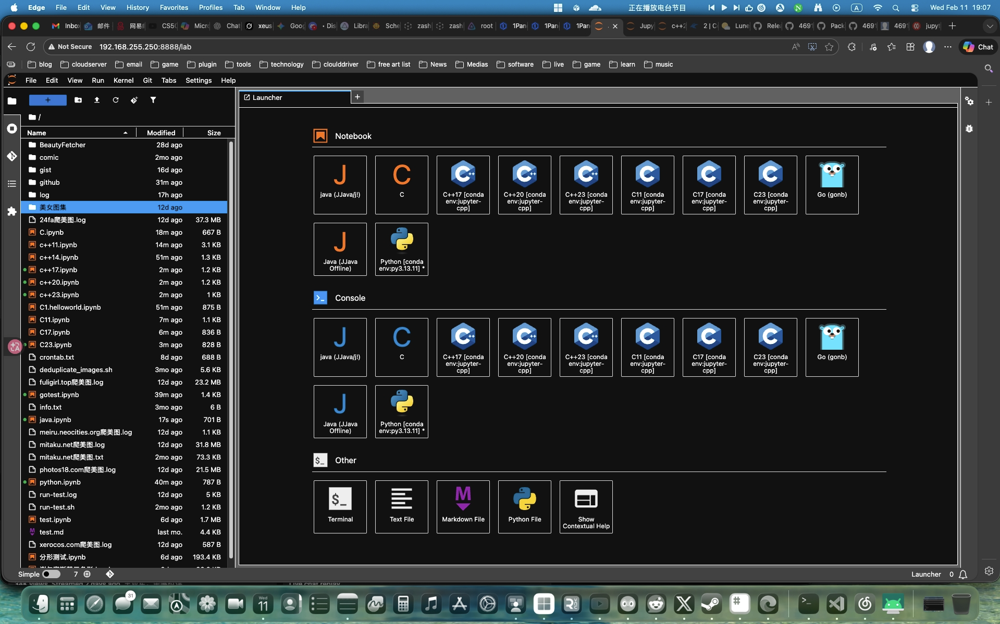
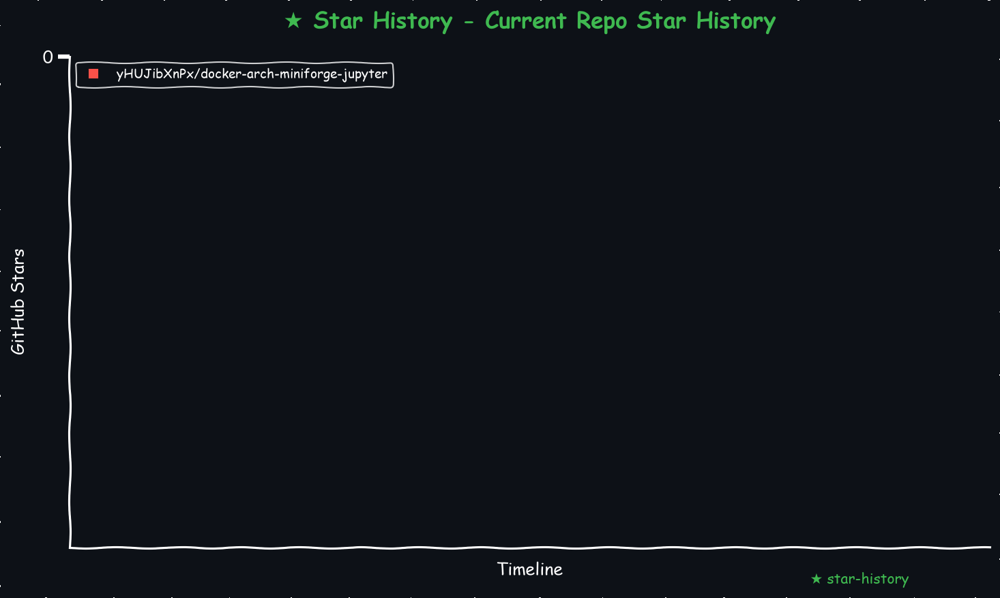
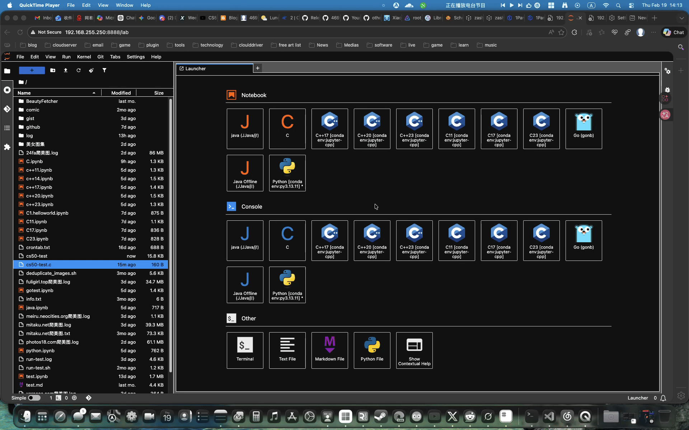
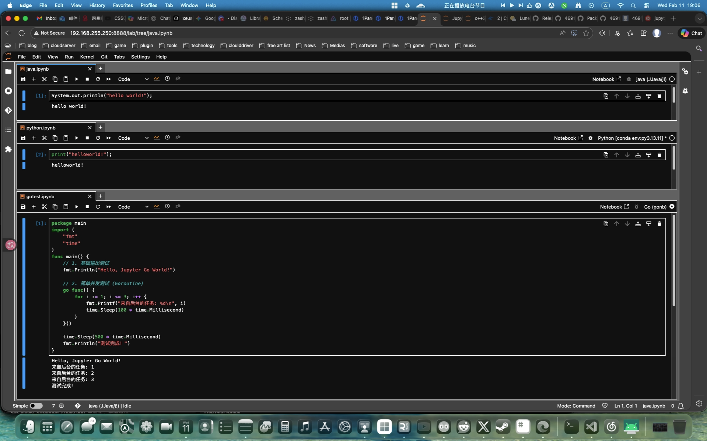
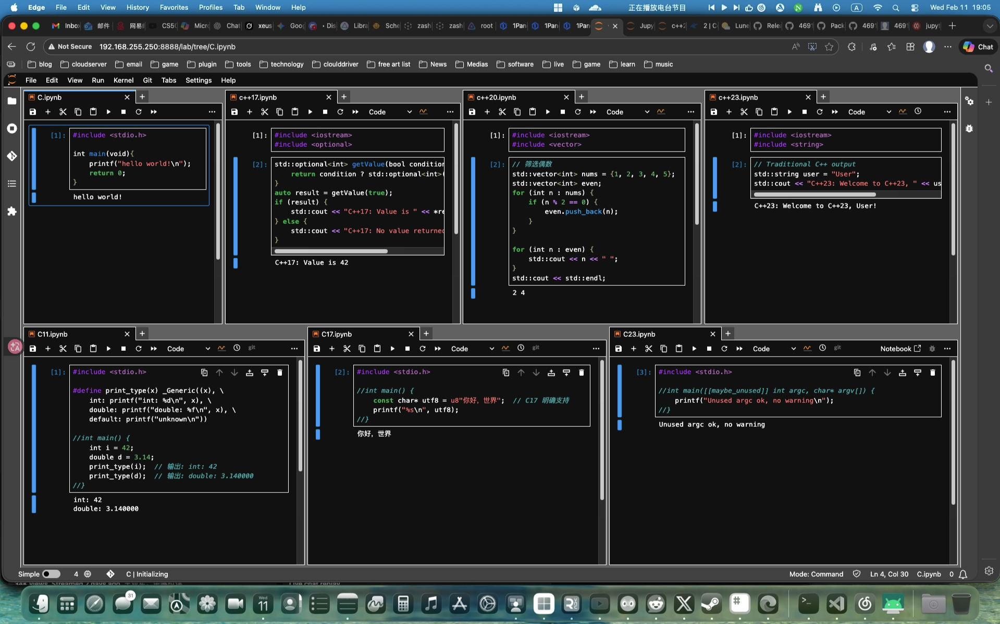
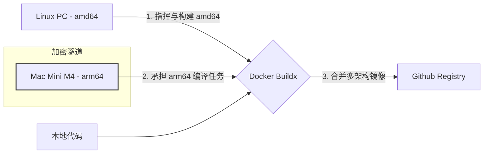

# docker-arch-miniforge-jupyter
miniforge 安装 jupyter notebook 封装特殊需求自用 python 测试容器 本项目通过 Docker 构建了一个多内核 Jupyter 环境，集成了 Python、C++ GO 和 Java 的内核并编译安装 CS50(libcs50) 函数库用于学习 CS50 C 语言课程。项目基于 Miniforge 构建，并通过自动化脚本完成各项配置（如 Jupyter 自动配置、默认密码、终端、主题等）。



    
<!-- <a href="https://star-history.com/#yHUJibXnPx/docker-arch-miniforge-jupyter&Date">
  <picture>
    <source media="(prefers-color-scheme: dark)" srcset="https://api.star-history.com/svg?repos=yHUJibXnPx/docker-arch-miniforge-jupyter&type=Date&theme=dark" />
    <source media="(prefers-color-scheme: light)" srcset="https://api.star-history.com/svg?repos=yHUJibXnPx/docker-arch-miniforge-jupyter&type=Date" />
    
  </picture>
</a> -->
<!-- START_STAR_HISTORY_SELF -->

<!-- END_STAR_HISTORY_SELF -->

## 目录结构

项目工作目录如下：

```
.
├── .env.amd64                 # Docker Compose 配置文件所需 amd64 环境，需要更名为 .env 使用
├── .env.arm64                 # Docker Compose 配置文件所需 arm64 环境，需要更名为 .env 使用
├── docker-compose.yml         # Docker Compose 配置文件，用于多容器编排（例如搭配其它服务时使用）
├── Dockerfile                 # 构建 Docker 镜像的说明文件
├── LICENSE                    # 许可协议文件
├── README.md                  # 本项目说明文档
├── requestment.txt            # Python脚本所需依赖  
├── make_star_chart.py         # 生成 星星统计 脚本  
└── scripts                    # 脚本目录，包含各项自动化安装和启动脚本
    ├── analyze_size.sh        # 日志记录点，虽跳出三界外不在五行中，但却在道之内，为精简优化镜像提供参考
    ├── clean.sh               # 清理构建产物或停止容器的脚本
    ├── common.sh              # 通用日志、函数等辅助脚本
    ├── init_system.sh         # 系统初始化脚本（例如配置 locale、环境变量等）
    ├── install_supercronic.sh # 安装 supercronic 的脚本，用于创建定时任务支持环境
    ├── install_miniforge.sh   # 安装 Miniforge 的脚本，用于创建 conda 环境
    ├── install_jupyter.sh     # 安装并配置 Jupyter（包括内核、密码、默认终端/主题）的脚本
    ├── install_libcs50.sh     # 安装并配置 libcs50 的脚本
    ├── install_jdk.sh         # 安装 JDK 环境的脚本
    ├── install_jbang.sh       # 安装 jbang（用于 Java 工具链）的脚本
    ├── install_go.sh          # 安装并配置 go 环境的脚本
    ├── install_gonb.sh        # 安装 gonb（用于 go 工具链）的脚本
    └── start_jupyter.sh       # 启动 Jupyter 服务的脚本
```

## 特点

- **多语言支持**  
  - Python 内核  
  - C/C++ 内核：通过 `jupyter-c-kernel`, ~`xeus-cling`~, `xeus-cpp` 部署相应内核, 默认提供 C, C11, C17, C23, C++17, C++20, C++23 内核
  - Java 内核：通过 `jbang` 与 `Java(openjdk)` 部署相应内核。
  - Go 内核：通过 `GoNB` 与 `GO` 部署相应内核。

- **自动化配置**  
  - 自动生成 Jupyter 配置文件（`jupyter_server_config.py`、用户覆盖设置），设置默认密码、默认终端（`/bin/bash`）及黑暗主题。  
  - 脚本化安装与构建，确保在非交互式 Docker 环境中稳定运行。

- **数据科学支持**  
  包含多个常用数据科学和开发工具包（例如 numpy、pandas、jupyter_contrib_nbextensions 等），以满足开发与实验需求。

## 快速入门

### 通过 docker-compose 文件启动（如果你在 docker-compose.yml 中配置了服务）：

根据你的系统cpu架构选择正确的环境文件比如 .env.arm64 修改完善后，改名为 .env 以支持 docker-compose.yml 文件

```bash
docker-compose up -d
```

### 通过 docker 启动 Jupyter 服务

项目中通过 `tini` 执行 `start_jupyter.sh` 启动 Jupyter 服务。你可以直接进入容器后执行脚本，或在 Docker Compose 设置中指定此命令。启动后，服务默认监听 8888 端口。

例如，通过 docker 运行容器：

```bash
# 后台运行
# --rm 不能和 --restart=always 一起用，这是两个相反的命令
# 要么用 --rm 容器终止即删除
# 要么用 --restart=always 容器中断自动重启
docker run --restart=always \
  --name miniforge_jupyter_container \
  -it -d \
  -p 8888:8888 \
  -e JUPYTER_PASSWORD=123456 \
  -v "./jupyter/notebook:/notebook" \
  -v "./jupyter/.jupyter:/root/.jupyter" \
  ghcr.io/yHUJibXnPx/docker-arch-miniforge-jupyter:latest \
  sh -c "tini -- /usr/local/bin/start_jupyter.sh"

# 查看日志
docker logs -f miniforge_jupyter_container

# 终止容器
docker stop miniforge_jupyter_container

# 删除容器
docker rm -fv miniforge_jupyter_container
```

### 访问 JupyterLab

在浏览器中打开 `http://localhost:8888`，按照 .env 配置文件中设置的密码或者 `123456` 登录。

### 密码修改
在浏览器中打开 `http://localhost:8888`，登陆，打开 `terminal` 终端
执行以下命令，并输入两次密码(不会显示字符)，重启容器完成密码修改
```bash
# 修改密码
jupyter notebook password
# 重启容器
docker-compose restart
```

### 测试内核
关于 CS50 函数库的使用，在 Jupyter Notebook 中，新建 C 语言源码文件时，可以选择 Text file 来创建文件并保存改名为 .c 后缀的 C 语言源码:  

- **使用 cs50.h 基础代码示例**

  - **创建保存文件名字为 `cs50-test.c`**
      ```c
      #include <stdio.h>
      #include <cs50.h>
    
      int main(void){
          string s_info = get_string("请输入内容: ");
          printf("内容是: %s\n",s_info);
          return 0;
      }
      ```
  
  - **在 Jupyter Notebook 中打开终端(Terminal)，执行编译命令导入 cs50 函数库，生成二进制文件 `cs50-test`**
      ```bash
      clang -o cs50-test cs50-test.c -I/usr/local/include -L/usr/local/lib -lcs50
      ```

  - **在终端(Terminal)中运行编译完成的二进制文件**
      ```bash
      ./cs50-test
      ```



在 Jupyter Notebook 中，新建 Notebook 时，可以选择不同的内核（例如 Python Java Go C C++）。可将以下代码分别粘贴到不同内核 ipynb 页面的 cell 中测试:  

- **Python 示例**

  ```python
  print('Hello, World! (Python)')
  word_str='af5ab649831964'
  word_str[::-1]
  ```

- **Java 示例**

  ```java
  System.out.println("Hello, World! (Java)");
  ```

- **Go 示例**

  ```go
  package main
  import (
      "fmt"
      "time"
  )
  func main() {
      // 1. 基础输出测试
      fmt.Println("Hello, Jupyter Go World!")
      
      // 2. 简单并发测试 (Goroutine)
      go func() {
          for i := 1; i <= 3; i++ {
              fmt.Printf("来自后台的任务: %d\n", i)
              time.Sleep(100 * time.Millisecond)
          }
      }()
  
      time.Sleep(500 * time.Millisecond)
      fmt.Println("测试完成！")
  }
  ```



在使用 C 内核时选择 C 与 C++ 内核不同，可以在一个cell中运行，但缺点是cell之间的变量无法传递。
- **C 示例**

  ```c
  #include <stdio.h>

  int main(void){
      printf("hello world!\n");
      return 0;
  }
  ```


在使用 C++ 内核时，需注意以下事项：

1. **清理内核以避免变量冲突报错**：
   - 频繁测试代码时，建议经常清理内核。
   - 重复执行同一个 cell 会导致变量名重复定义，因为 Jupyter 会存储这些变量。

2. **代码组织建议**：
   - 去掉了常规的 main 函数，可以直接运行主代码，且 cell 之间共享变量。
   - 将不同功能的代码分离到不同的 cell 中按顺序执行。例如：
     - **头文件引用**：放入一个单独的 cell，仅需执行一次。
     - **变量定义**：放入一个单独的 cell，仅需执行一次。
     - **代码逻辑执行**：放入一个单独的 cell，可多次执行。

3. **使用独特变量名称**：尽量避免变量名重复，这是减少冲突的好习惯。

4. **解决报错的方法**：
   - 点击菜单中的 **"内核" -> "重新启动并清除输出"** 来清理之前定义的变量。
   - 然后重新运行需要的代码。

- **C11 示例**

  ```c 11
  #include <stdio.h>

  #define print_type(x) _Generic((x), \
      int: printf("int: %d\n", x), \
      double: printf("double: %f\n", x), \
      default: printf("unknown\n"))

  //int main() {
      int i = 42;
      double d = 3.14;
      print_type(i);  // 输出: int: 42
      print_type(d);  // 输出: double: 3.140000
  //}
  ```

- **C17 示例**
  ```c 17
  #include <stdio.h>

  //int main() {
      const char* utf8 = u8"你好，世界";  // C17 明确支持
      printf("%s\n", utf8);
  //}
  ```

- **C23 示例**
  ```c 23
  #include <stdio.h>

  //int main([[maybe_unused]] int argc, char* argv[]) {
      printf("Unused argc ok, no warning\n");
  //}
  ```

- **C++17 示例**

  ```c++ 17
  #include <iostream>
  #include <optional>

  //int main() {
      std::optional<int> getValue(bool condition) {
          return condition ? std::optional<int>(42) : std::nullopt;
      }
      auto result = getValue(true);
      if (result) {
          std::cout << "C++17: Value is " << *result << std::endl;
      } else {
          std::cout << "C++17: No value returned" << std::endl;
      }
  //}
  ```

- **C++20 示例**

  ```c++ 20
  #include <iostream>
  #include <vector>

  //int main() {
      // 筛选偶数
      std::vector<int> nums = {1, 2, 3, 4, 5};
      std::vector<int> even;
      for (int n : nums) {
          if (n % 2 == 0) {
              even.push_back(n);
          }
      }
    
      for (int n : even) {
          std::cout << n << " ";
      }
      std::cout << std::endl;
  //}
  ```

- **C++23 示例**

  ```c++ 23
  #include <iostream>
  #include <string>

  //int main() {
      // Traditional C++ output
      std::string user = "User";
      std::cout << "C++23: Welcome to C++23, " << user << "!" << std::endl;
  //}
  ```



## 已知问题与调试

- 若 Jupyter 配置（密码、默认终端或主题）未生效，请检查容器启动日志中是否正确生成 `~/.jupyter` 下的配置文件。
- 容量太大，个人学习使用还可以，共享出来也少有人能用上，构建出这么大的镜像不如安装到本机

## 定制与扩展

- 如果你需要添加新的内核或者修改现有内核配置，请参考 `scripts/install_jupyter.sh` 中的自动化配置逻辑。  
- 更多配置项可参见 [Jupyter 官方文档](https://docs.jupyter.org/en/latest/index.html)，结合项目需求进行扩展。

## 构建 Docker 镜像

你可能需要一些前置条件，比如 docker compose buildx 环境的部署
稍微说一下吧，点到为止  
比如我的机器是 Ubuntu 24.04 LTS (GNU/Linux 6.8.0-57-generic aarch64)

  - **docker 部署过程如下：**

```bash
# 系统可以使用官方一键安装脚本 https://github.com/docker/docker-install
curl -fsSL https://test.docker.com -o test-docker.sh
sh test-docker.sh
# Manage Docker as a non-root user
## 非 root 用户需要加入到 docker 组才有权限使用
# Create the docker group
## 添加 docker 组
sudo groupadd docker
# Add your user to the docker group.
## 将当前用户加入到 docker 组权限
sudo usermod -aG docker ${USER}
# Log out and log back in so that your group membership is re-evaluated.
## 临时进入 docker 组测试，更好的方式是退出并重新登录测试
newgrp docker 
# Configure Docker to start on boot
# 启用 docker 开机自启动服务
sudo systemctl enable docker.service
sudo systemctl enable containerd.service
# satrt
# 开启 docker 服务，其实上一步就启用了
sudo systemctl start docker.service
sudo systemctl start containerd.service
# Verify that Docker Engine is installed correctly by running the hello-world image
# 测试 docker hello-world:latest 打印
docker run --rm hello-world:latest
```

  - **compose 部署更新过程如下：**

```bash
# GitHub 项目 URI
URI="docker/compose"

# 获取最新版本
VERSION=$(curl -sL "https://github.com/${URI}/releases" | grep -Eo '/releases/tag/[^"]+' | awk -F'/tag/' '{print $2}' | head -n 1)
echo "Latest version: ${VERSION}"

# 获取操作系统和架构信息
OS=$(uname -s)
ARCH=$(uname -m)

# 映射平台到官方命名
case "${OS}" in
  Linux)
    PLATFORM="linux"
    if [[ "${ARCH}" == "arm64" || "${ARCH}" == "aarch64" ]]; then
      ARCH="aarch64"
    elif [[ "${ARCH}" == "x86_64" ]]; then
      ARCH="x86_64"
    else
      echo "Unsupported architecture: ${ARCH}"
      echo 'should exit 1'
    fi
    ;;
  *)
    echo "Unsupported OS: ${OS}"
    echo 'should exit 1'
    ;;
esac

# 输出最终平台和架构
echo "Platform: ${PLATFORM}"
echo "Architecture: ${ARCH}"

# 拼接下载链接和校验码链接
TARGET_FILE="docker-compose-${PLATFORM}-${ARCH}"
SHA256_FILE="${TARGET_FILE}.sha256"
URI_DOWNLOAD="https://github.com/${URI}/releases/download/${VERSION}/${TARGET_FILE}"
URI_SHA256="https://github.com/${URI}/releases/download/${VERSION}/${SHA256_FILE}"
echo "Download URL: ${URI_DOWNLOAD}"
echo "SHA256 URL: ${URI_SHA256}"

# 检查文件是否存在
if [[ -f "/tmp/${TARGET_FILE}" ]]; then
  echo "File already exists: /tmp/${TARGET_FILE}"
  
  # 删除旧的 SHA256 文件（如果存在）
  if [[ -f "/tmp/${SHA256_FILE}" ]]; then
    echo "Removing old SHA256 file: /tmp/${SHA256_FILE}"
    rm -fv "/tmp/${SHA256_FILE}"
  fi

  # 下载新的 SHA256 文件
  echo "Downloading SHA256 file..."
  curl -L -C - --retry 3 --retry-delay 5 --progress-bar -o "/tmp/${SHA256_FILE}" "${URI_SHA256}"

  # 校验文件完整性
  # shasum 校验依赖 perl 可能 linux 系统需要手动安装
  echo "Verifying file integrity for /tmp/${TARGET_FILE}..."
  cd /tmp
  if ! shasum -a 256 -c "${SHA256_FILE}"; then
    log_warning "SHA256 checksum failed. Removing file and retrying..."
    rm -fv "/tmp/${TARGET_FILE}"
  else
    echo "File integrity verified successfully."
  fi
fi

# 如果文件不存在或之前校验失败
if [[ ! -f "/tmp/${TARGET_FILE}" ]]; then
  echo "Downloading file..."
  curl -L -C - --retry 3 --retry-delay 5 --progress-bar -o "/tmp/${TARGET_FILE}" "${URI_DOWNLOAD}"

  # 删除旧的 SHA256 文件并重新下载
  if [[ -f "/tmp/${SHA256_FILE}" ]]; then
    echo "Removing old SHA256 file: /tmp/${SHA256_FILE}"
    rm -fv "/tmp/${SHA256_FILE}"
  fi
  echo "Downloading SHA256 file..."
  curl -L --progress-bar -o "/tmp/${SHA256_FILE}" "${URI_SHA256}"

  # 校验完整性
  # shasum 校验依赖 perl 可能 linux 系统需要手动安装
  echo "Verifying file integrity for /tmp/${TARGET_FILE}..."
  cd /tmp
  if ! shasum -a 256 -c "${SHA256_FILE}"; then
    echo "Download failed: SHA256 checksum does not match."
    echo 'should exit 1'
  else
    echo "File integrity verified successfully."
  fi
fi

sudo mv -fv "/tmp/${TARGET_FILE}" /usr/local/bin/docker-compose
# Apply executable permissions to the binary
## 赋予执行权
sudo chmod -v +x /usr/local/bin/docker-compose
# create a symbolic link to /usr/libexec/docker/cli-plugins/
# 创建插件目录和软链接
sudo mkdir -pv /usr/libexec/docker/cli-plugins/
sudo ln -sfv /usr/local/bin/docker-compose /usr/libexec/docker/cli-plugins/docker-compose
# Test the installation.
## 测试版本打印
docker-compose version
docker compose version
```

  - **buildx 部署更新过程如下：**

```bash
# GitHub 项目 URI
URI="docker/buildx"

# 获取最新版本
VERSION=$(curl -sL "https://github.com/${URI}/releases" | grep -Eo '/releases/tag/[^"]+' | awk -F'/tag/' '{print $2}' | head -n 1)
echo "Latest version: ${VERSION}"

# 获取操作系统和架构信息
OS=$(uname -s)
ARCH=$(uname -m)

# 映射平台到官方命名
case "${OS}" in
  Linux)
    PLATFORM="linux"
    if [[ "${ARCH}" == "arm64" || "${ARCH}" == "aarch64" ]]; then
      ARCH="arm64"
    elif [[ "${ARCH}" == "x86_64" ]]; then
      ARCH="amd64"
    else
      echo "Unsupported architecture: ${ARCH}"
      echo 'should exit 1'
    fi
    ;;
  *)
    echo "Unsupported OS: ${OS}"
    echo 'should exit 1'
    ;;
esac

# 输出最终平台和架构
echo "Platform: ${PLATFORM}"
echo "Architecture: ${ARCH}"

# 拼接下载链接和校验码链接
TARGET_FILE="buildx-${VERSION}.${PLATFORM}-${ARCH}"
SHA256_FILE="${TARGET_FILE}.sbom.json"
URI_DOWNLOAD="https://github.com/${URI}/releases/download/${VERSION}/${TARGET_FILE}"
URI_SHA256="https://github.com/${URI}/releases/download/${VERSION}/${SHA256_FILE}"
echo "Download URL: ${URI_DOWNLOAD}"
echo "SHA256 URL: ${URI_SHA256}"

# 检查文件是否存在
if [[ -f "/tmp/${TARGET_FILE}" ]]; then
  echo "File already exists: /tmp/${TARGET_FILE}"
  
  # 删除旧的 SHA256 文件（如果存在）
  if [[ -f "/tmp/${SHA256_FILE}" ]]; then
    echo "Removing old SHA256 file: /tmp/${SHA256_FILE}"
    rm -fv "/tmp/${SHA256_FILE}"
  fi

  # 下载新的 SHA256 文件
  echo "Downloading SHA256 file..."
  curl -L -C - --retry 3 --retry-delay 5 --progress-bar -o "/tmp/${SHA256_FILE}" "${URI_SHA256}"
  # 提取校验码
  CHECKSUM=$(cat "/tmp/${SHA256_FILE}" | jq -r --arg filename "${TARGET_FILE}" '.subject[] | select(.name == $filename) | .digest.sha256')
  # 将校验码写入源文件
  echo "${CHECKSUM} *${TARGET_FILE}" > "/tmp/${SHA256_FILE}"
  echo "校验码 ${CHECKSUM} 已写入文件: /tmp/${SHA256_FILE}"

  # 校验文件完整性
  # shasum 校验依赖 perl 可能 linux 系统需要手动安装
  echo "Verifying file integrity for /tmp/${TARGET_FILE}..."
  cd /tmp
  if ! shasum -a 256 -c "${SHA256_FILE}"; then
    log_warning "SHA256 checksum failed. Removing file and retrying..."
    rm -fv "/tmp/${TARGET_FILE}"
  else
    echo "File integrity verified successfully."
  fi
fi

# 如果文件不存在或之前校验失败
if [[ ! -f "/tmp/${TARGET_FILE}" ]]; then
  echo "Downloading file..."
  curl -L -C - --retry 3 --retry-delay 5 --progress-bar -o "/tmp/${TARGET_FILE}" "${URI_DOWNLOAD}"

  # 删除旧的 SHA256 文件并重新下载
  if [[ -f "/tmp/${SHA256_FILE}" ]]; then
    echo "Removing old SHA256 file: /tmp/${SHA256_FILE}"
    rm -fv "/tmp/${SHA256_FILE}"
  fi
  echo "Downloading SHA256 file..."
  curl -L --progress-bar -o "/tmp/${SHA256_FILE}" "${URI_SHA256}"
  # 提取校验码
  CHECKSUM=$(cat "/tmp/${SHA256_FILE}" | jq -r --arg filename "${TARGET_FILE}" '.subject[] | select(.name == $filename) | .digest.sha256')
  # 将校验码写入源文件
  echo "${CHECKSUM} *${TARGET_FILE}" > "/tmp/${SHA256_FILE}"
  echo "校验码 ${CHECKSUM} 已写入文件: /tmp/${SHA256_FILE}"

  # 校验完整性
  # shasum 校验依赖 perl 可能 linux 系统需要手动安装
  echo "Verifying file integrity for /tmp/${TARGET_FILE}..."
  cd /tmp
  if ! shasum -a 256 -c "${SHA256_FILE}"; then
    echo "Download failed: SHA256 checksum does not match."
    echo 'should exit 1'
  else
    echo "File integrity verified successfully."
  fi
fi

sudo mv -fv "/tmp/${TARGET_FILE}" /usr/local/bin/docker-buildx
# Apply executable permissions to the binary
## 赋予执行权
sudo chmod -v +x /usr/local/bin/docker-buildx
# create a symbolic link to /usr/libexec/docker/cli-plugins/
# 创建插件目录和软链接
sudo mkdir -pv /usr/libexec/docker/cli-plugins/
sudo ln -sfv /usr/local/bin/docker-buildx /usr/libexec/docker/cli-plugins/docker-buildx
## 测试版本打印
docker-buildx version
docker buildx version
```

  - **scout-cli 部署更新过程如下：**
  Docker Scout 是一组集成到 Docker 用户界面和命令行界面 （CLI） 中的软件供应链功能。这些功能提供了对容器映像的结构和安全性的全面可见性。 此存储库包含 CLI 插件的可安装二进制文件。
  ```bash
mkdir -pv $HOME/.docker
curl -sSfL https://raw.githubusercontent.com/docker/scout-cli/main/install.sh | sh -s --
  ```
  1. scout-cli 使用例子，登陆docker账号，其中 `yHUJibXnPx` 换成你自己的
  ```bash
docker login -u yHUJibXnPx
  ```
  2. 注册到已知的组织单位，如果你有的话，没有可以不执行
  ```bash
docker scout enroll ORG_NAME
  ```
  3. 快速查看镜像
  ```bash
docker scout quickview hello-world:latest
  ```
  会返回以下信息，其中漏洞等级含义如下
  | CVSS分数    | 漏洞等级   |
  |------------|--------------|
  | 9.0 – 10.0 | **关键** (C) |
  | 7.0 – 8.9  | **高** (H)   |
  | 4.0 – 6.9  | **中** (M)   |
  | 0.1 – 3.9  | **低** (L)   |
  ```plaintext
    ✓ Image stored for indexing
    ✓ Indexed 0 packages
    ✓ 1 exception obtained

    i Base image was auto-detected. To get more accurate results, build images with max-mode provenance attestations.
      Review docs.docker.com ↗ for more information.

  Target   │  hello-world:latest  │    0C     0H     0M     0L   
    digest │  1b44b5a3e06a        │                              

What's next:
    Include policy results in your quickview by supplying an organization → docker scout quickview hello-world:latest --org <organization>
  ```
  4. 检测镜像漏洞
  ```bash
docker scout cves --only-package hello-world:latest
  ```
  会返回以下内容，
  ```plaintext
    ✓ SBOM of image already cached, 1183 packages indexed
    ✓ No vulnerable package detected


## Overview

                    │       Analyzed Image         
────────────────────┼──────────────────────────────
  Target            │                              
    digest          │  4fbad79ded98                
    platform        │ linux/amd64                  
    vulnerabilities │    0C     0H     0M     0L   
    size            │ 1.1 GB                       
    packages        │ 0                            


## Packages and Vulnerabilities

  No vulnerable packages detected
  ```
  5. 比较两个镜像的安全性与依赖差异，比如 hello-world 不同版本间的比较(`docker scout compare`是实验性功能，未来会有变化)
  ```bash
# pull 两个不同版本 
docker pull hello-world:latest
docker pull hello-world:nanoserver:1709
# 比较
docker scout compare --to hello-world:latest hello-world:nanoserver1709
  ```
  会返回以下内容，
  ```plaintext
    ! 'docker scout compare' is experimental and its behaviour might change in the future
    ✓ Pulled
    ✓ Image stored for indexing
    ✓ Indexed 1 packages
    ✓ SBOM of image already cached, 0 packages indexed
    ✓ 1 exception obtained
    ✓ 1 exception obtained
  
  
  ## Overview
  
                      │        Analyzed Image        │      Comparison Image        
  ────────────────────┼──────────────────────────────┼──────────────────────────────
    Target            │  hello-world:nanoserver1709  │  hello-world:latest          
      digest          │  786a29974908                │  1b44b5a3e06a                
      tag             │  nanoserver1709              │  latest                      
      platform        │ windows/amd64                │ linux/amd64                  
      vulnerabilities │    0C     0H     0M     0L   │    0C     0H     0M     0L   
                      │                              │                              
      size            │ 99 MB (+99 MB)               │ 2.5 kB                       
      packages        │ 1 (+1)                       │ 0                            
                      │                              │                              
  
  
  ## Environment Variables
  
  
    - PATH=/usr/local/sbin:/usr/local/bin:/usr/sbin:/usr/bin:/sbin:/bin
  
  
  
  ## Packages and Vulnerabilities
  
  
    +    1 packages added
  
  
  
  
     Package              Type   Version        Compared Version  
  
  +  runscripthelper.exe  nuget  10.0.16299.15
  ```

  - **docker buildx build 在项目目录下执行构建镜像具体流程命令 ：**
为了缩减层级空间，本镜像已经修改 Dockerfile  
将 `COPY scripts/ /usr/local/src/scripts` 替换为 RUN 层 `--mount=type=bind,source=scripts,target=/usr/local/src/scripts` 替代等效且不会产生大层级  
只要 `COPY` 和 `rm` 不在同一个指令里，体积就永远减不下来  
最后将多层镜像灌入到绝对零空间 `FROM scratch` `COPY --from=builder / /`  
`--mount=type=bind,source=,target=` 就相当于在构建的时候将只读u盘插入到目标目录，这样这个层级的资源既可以使用，又不会产生空间占用。  
```bash
# docker proxy pull
## 配置 docker 代理，比如 http://192.168.255.253:7890
sudo mkdir -pv /etc/systemd/system/docker.service.d
cat << '469138946ba5fa' | sudo tee /etc/systemd/system/docker.service.d/http-proxy.conf
[Service]
Environment="HTTP_PROXY=http://192.168.255.253:7890"
Environment="HTTPS_PROXY=http://192.168.255.253:7890"
Environment="NO_PROXY=localhost,127.0.0.1,192.168.255.0/24"
469138946ba5fa
sudo systemctl daemon-reload
sudo systemctl restart docker
sudo systemctl show --property=Environment docker

# docker login & config
## 使用 github 具有上传下载镜像权限 [write:packages(read:packages)] 的 token 登陆 github 并预配置用户和目录参数
echo '请输入具有上传下载镜像权限 [write:packages(read:packages)] 的 github token (不会显示输入内容):' ; read -sr GITHUB_TOKEN
echo '请输入 github 用户名(为空则默认是 yHUJibXnPx ):' ; read -r USERNAME
echo '请输入你的 github 镜像存储源(为空则默认是 ghcr.io ):' ; read -r DOCKER_DOMAIN
echo '请输入 docker 项目存放的父目录(为空则默认目录 /media/psf/KingStonSSD1T/docker-workspace ):' ; read -r CUSTOM_DIR
echo '请输入你的 docker 项目名(为空则默认是我的仓库名即 docker-arch-miniforge-jupyter ):' ; read -r REPO
echo '请输入你的 docker buildx 构建可能需要的大缓存存储目录(为空则默认目录 /media/psf/KingStonSSD1T/docker_buildx.cache ):' ; read -r BUILDX_CACHE

## 执行登陆和变量赋值解除
USERNAME=${USERNAME:-yHUJibXnPx}
DOCKER_DOMAIN=${DOCKER_DOMAIN:-ghcr.io}
echo ${GITHUB_TOKEN} | docker login ${DOCKER_DOMAIN} -u ${USERNAME} --password-stdin ; unset GITHUB_TOKEN
CUSTOM_DIR=${CUSTOM_DIR:-'/media/psf/KingStonSSD1T/docker-workspace'}
REPO=${REPO:-docker-arch-miniforge-jupyter}
BUILDX_CACHE=${BUILDX_CACHE:-'/media/psf/KingStonSSD1T/docker_buildx.cache'}

## 创建缓存目录和新缓存目录
mkdir -pv ${BUILDX_CACHE}
mkdir -pv ${BUILDX_CACHE}-new
echo ${USERNAME}
echo ${DOCKER_DOMAIN}
echo ${CUSTOM_DIR}/${REPO}
echo ${BUILDX_CACHE}
echo ${BUILDX_CACHE}-new

## 进入到项目目录
cd ${CUSTOM_DIR}/${REPO}

# stop and remove containerd
## 停止并移除当前运行容器
docker-compose stop
docker-compose rm -fv

# delete image tag
## 删除当前镜像，如果需要可以解除注释粘贴执行
#docker rmi ${DOCKER_DOMAIN}/${USERNAME}/${REPO}:latest

# All emulators:
## 多架构跨平台环境虚拟
docker run --privileged --rm tonistiigi/binfmt:master --install all
# Show currently supported architectures and installed emulators
docker run --privileged --rm tonistiigi/binfmt:master

# docker buildx 
## 使用 docker buildx 构建单/多架构镜像
# buildx create
## 停用删除已有的 builder
docker-buildx stop ${REPO}
docker-buildx rm -f ${REPO}
## 创建 buildx 构建节点并启用
#docker-buildx create --use
docker-buildx create --name ${REPO} --use
## 或者和上一步骤二选一如果最终测试不好也可以换用代理模式比如 192.168.255.253:7890 创建 buildx 构建节点并启用
docker buildx create --use --name ${REPO} \
  --driver docker-container \
  --driver-opt env.http_proxy=http://192.168.255.253:7890 \
  --driver-opt env.https_proxy=http://192.168.255.253:7890

## 实例启动后查看 builder 信息
docker-buildx inspect --bootstrap

#  说明：
#  --build-arg 可以用于为构建容器添加环境变量，比如代理环境
#    --build-arg HTTP_PROXY="http://192.168.255.253:7890" --build-arg HTTPS_PROXY="http://192.168.255.253:7890" --build-arg NO_PROXY="localhost,127.0.0.1,google.cn"
#  --platform linux/arm64/v8,linux/amd64 表示构建多个平台的镜像。
#  --tag 参数根据你自己的环境变量（例如 DOCKER_DOMAIN、USERNAME、REPO）设置镜像名称。
#  --no-cache 选项来避免使用过多的缓存，不要与 --cache-from 和 --cache-to 合用
#  --cache-from 从 ${BUILDX_CACHE} 目录中加载缓存数据，加速构建。
#  --cache-to 将新生成的缓存数据写入到 ${BUILDX_CACHE}-new 目录中。
#  --label 添加单镜像标签应该和 Dockerfile 中的 LABEL 等效
#  --load 表示将构建完成的镜像加载到 Docker 本地镜像库中（对于跨平台构建，注意在某些情况下可能只能加载当前体系结构的镜像）。
#  --push 表示将构建完成的镜像推送到 Docker 远端镜像库中 
#  --output 导出器以下是type参数信息
#    type=image 导出类型为 image 镜像 type=oci 则是导出镜像为 OCI 标准归档文件，允许在本地离线处理多架构镜像，脱离对实时网络连接的依赖。
#    name=ghcr.io/yHUJibXnPx/docker-arch-miniforge-jupyter:latest 镜像名
#    compression=zstd 压缩类型 zstd 也支持 gzip 和 estargz
#    compression-level=22 设置 zstd 压缩级别为 22 ，gzip 和 estargz 的范围是 0-9 ， zstd 的范围是 0-22
#    force-compression=true 强制重压缩
#  最近发现对于多架构镜像需要额外在 --output 中配置多架构标签属性 --label 仅适用于单架构情况 https://docs.github.com/en/packages/working-with-a-github-packages-registry/working-with-the-container-registry#adding-a-description-to-multi-arch-images
#  --output 
#    annotation-index.org.opencontainers.image.description='' 多架构镜像注释标签
#    annotation-index.org.opencontainers.image.title='' 多架构镜像标题标签
#    annotation-index.org.opencontainers.image.version='' 多架构镜像版本标签
#    annotation-index.org.opencontainers.image.authors='' 多架构镜像作者标签
#    annotation-index.org.opencontainers.image.source='' 多架构镜像关联仓库标签
#    annotation-index.org.opencontainers.image.licenses='' 多架构镜像协议标签
#  最近发现云端镜像仓库有 unknown/unknown 未识别架构的问题，如下方案可以规避云端仓库 https://github.com/docker/buildx/issues/1964#issuecomment-1644634461
#  --output 导出器 type=oci-mediatypes=false 关闭OCI索引，然而失败了☹️，unknown/unknown 显示问题存在
#  --provenance=false 设置为不生成来源信息，但禁用 provenance 信息，意味着你失去了有关构建过程的详细记录和签名。这对追踪镜像的安全性和来源可能会有一些影响，可以解决 unknown/unknown 显示问题
#  参考 https://docs.docker.com/build/building/variables/#buildx_no_default_attestations
#  export BUILDX_NO_DEFAULT_ATTESTATIONS=1 添加环境变量禁用来源证明应该和 --provenance=false 等效，也可以解决 unknown/unknown 显示问题
#  综上，我觉得 unknown/unknown 也可以接受，就这样吧

# buildx build load
## 单架构本地存储，比如 linux/arm64/v8 ，压缩生成镜像
docker buildx build \
  --platform linux/arm64/v8 \
  --cache-from type=local,src=${BUILDX_CACHE} \
  --cache-to type=local,dest=${BUILDX_CACHE}-new,mode=max \
  --output type=image,name=${DOCKER_DOMAIN}/${USERNAME}/${REPO}:latest,compression=zstd,compression-level=22,force-compression=true \
  --tag ${DOCKER_DOMAIN}/${USERNAME}/${REPO}:latest \
  --load .

# docker-compose test
## docker-compose 运行测试
docker-compose stop
docker-compose rm -fv
docker-compose up -d --force-recreate
## 容器日志 ctrl+c 退出
docker-compose logs -f
## 容器状态监控 ctrl+c 退出
docker-compose stats

# buildx build push
## 多架构上传仓库，比如 linux/arm64/v8,linux/amd64，去除oci索引，防止 unknown/unknown
## 正常构建镜像会很大，但是时间很短，上传会浪费大量带宽
# buildx build push
## 多架构上传仓库，比如 linux/arm64/v8,linux/amd64
## 正常构建镜像会很大，但是时间很短，上传会浪费大量带宽
docker buildx build \
  --platform linux/arm64/v8,linux/amd64 \
  --cache-from type=local,src=${BUILDX_CACHE} \
  --cache-to type=local,dest=${BUILDX_CACHE}-new,mode=max \
  --output type=image,name=${DOCKER_DOMAIN}/${USERNAME}/${REPO}:latest,\
annotation-index.org.opencontainers.image.description='miniforge 安装 jupyter notebook 封装特殊需求自用 python 测试容器，支持 amd64 和 arm64/v8 架构.',\
annotation-index.org.opencontainers.image.title='Miniforge Jupyter',\
annotation-index.org.opencontainers.image.version='1.0.0',\
annotation-index.org.opencontainers.image.authors='yHUJibXnPx <bXnPxyHUJi@outlook.com>',\
annotation-index.org.opencontainers.image.source='https://github.com/yHUJibXnPx/docker-arch-miniforge-jupyter',\
annotation-index.org.opencontainers.image.licenses='MIT' \
  --annotation org.opencontainers.image.description='miniforge 安装 jupyter notebook 封装特殊需求自用 python 测试容器，支持 amd64 和 arm64/v8 架构.' \
  --annotation org.opencontainers.image.title='Miniforge Jupyter' \
  --annotation org.opencontainers.image.version='1.0.0' \
  --annotation org.opencontainers.image.authors='yHUJibXnPx <bXnPxyHUJi@outlook.com>' \
  --annotation org.opencontainers.image.source='https://github.com/yHUJibXnPx/docker-arch-miniforge-jupyter' \
  --annotation org.opencontainers.image.licenses='MIT' \
  --push .

## 或者多架构上传仓库，比如 linux/arm64/v8,linux/amd64，压缩
## 但压缩会意味着浪费更多的时间，但是也许会节省带宽，然而我并不清楚压缩和正常构建之间的关系
docker buildx build \
  --platform linux/arm64/v8,linux/amd64 \
  --cache-from type=local,src=${BUILDX_CACHE} \
  --cache-to type=local,dest=${BUILDX_CACHE}-new,mode=max \
  --output type=image,name=${DOCKER_DOMAIN}/${USERNAME}/${REPO}:latest,compression=zstd,compression-level=22,force-compression=true,\
annotation-index.org.opencontainers.image.description='miniforge 安装 jupyter notebook 封装特殊需求自用 python 测试容器，支持 amd64 和 arm64/v8 架构.',\
annotation-index.org.opencontainers.image.title='Miniforge Jupyter',\
annotation-index.org.opencontainers.image.version='1.0.0',\
annotation-index.org.opencontainers.image.authors='yHUJibXnPx <bXnPxyHUJi@outlook.com>',\
annotation-index.org.opencontainers.image.source='https://github.com/yHUJibXnPx/docker-arch-miniforge-jupyter',\
annotation-index.org.opencontainers.image.licenses='MIT' \
  --annotation org.opencontainers.image.description='miniforge 安装 jupyter notebook 封装特殊需求自用 python 测试容器，支持 amd64 和 arm64/v8 架构.' \
  --annotation org.opencontainers.image.title='Miniforge Jupyter' \
  --annotation org.opencontainers.image.version='1.0.0' \
  --annotation org.opencontainers.image.authors='yHUJibXnPx <bXnPxyHUJi@outlook.com>' \
  --annotation org.opencontainers.image.source='https://github.com/yHUJibXnPx/docker-arch-miniforge-jupyter' \
  --annotation org.opencontainers.image.licenses='MIT' \
  --push .

## 或者多架构上传仓库，比如 linux/arm64/v8,linux/amd64，压缩，不生成镜像来源，防止 unknown/unknown
## 使用 export BUILDX_NO_DEFAULT_ATTESTATIONS=1 或 --provenance=false 禁用来源信息，意味着你失去了有关构建过程的详细记录和签名。这对追踪镜像的安全性和来源可能会有一些影响。
#export BUILDX_NO_DEFAULT_ATTESTATIONS=1
docker buildx build \
  --platform linux/arm64/v8,linux/amd64 \
  --cache-from type=local,src=${BUILDX_CACHE} \
  --cache-to type=local,dest=${BUILDX_CACHE}-new,mode=max \
  --output type=image,name=${DOCKER_DOMAIN}/${USERNAME}/${REPO}:latest,compression=zstd,compression-level=22,force-compression=true,\
annotation-index.org.opencontainers.image.description='miniforge 安装 jupyter notebook 封装特殊需求自用 python 测试容器，支持 amd64 和 arm64/v8 架构.',\
annotation-index.org.opencontainers.image.title='Miniforge Jupyter',\
annotation-index.org.opencontainers.image.version='1.0.0',\
annotation-index.org.opencontainers.image.authors='yHUJibXnPx <bXnPxyHUJi@outlook.com>',\
annotation-index.org.opencontainers.image.source='https://github.com/yHUJibXnPx/docker-arch-miniforge-jupyter',\
annotation-index.org.opencontainers.image.licenses='MIT' \
  --annotation org.opencontainers.image.description='miniforge 安装 jupyter notebook 封装特殊需求自用 python 测试容器，支持 amd64 和 arm64/v8 架构.' \
  --annotation org.opencontainers.image.title='Miniforge Jupyter' \
  --annotation org.opencontainers.image.version='1.0.0' \
  --annotation org.opencontainers.image.authors='yHUJibXnPx <bXnPxyHUJi@outlook.com>' \
  --annotation org.opencontainers.image.source='https://github.com/yHUJibXnPx/docker-arch-miniforge-jupyter' \
  --annotation org.opencontainers.image.licenses='MIT' \
  --provenance=false \
  --push .
#unset BUILDX_NO_DEFAULT_ATTESTATIONS
```

如果你构建镜像成功，但是多次传输失败，那不怕，别哭还有办法，多架构 OCI 归档导出并用 skopeo 多架构镜像上传，可以使用以下方法
```bash
# Skopeo 在传输大型 Blob 时比 Docker 原生 Push 更稳定，且支持从归档文件直接同步。
# 安装 Skopeo 请按照各自的系统进行安装
# Linux (Ubuntu/Debian): 
sudo apt-get install -y skopeo
# macOS: 
brew install skopeo
# Alpine: 
apk add skopeo

# 导出已经编译好的镜像缓存到本地 OCI 标准归档文件
docker buildx build \
  --platform linux/arm64/v8,linux/amd64 \
  --cache-from type=local,src=${BUILDX_CACHE} \
  --cache-to type=local,dest=${BUILDX_CACHE}-new,mode=max \
  --tag ${DOCKER_DOMAIN}/${USERNAME}/${REPO}:latest \
  --output type=oci,dest=./${REPO}.tar,name=${DOCKER_DOMAIN}/${USERNAME}/${REPO}:latest,compression=zstd,compression-level=22,force-compression=true,\
annotation-index.org.opencontainers.image.description='miniforge 安装 jupyter notebook 封装特殊需求自用 python 测试容器，支持 amd64 和 arm64/v8 架构.',\
annotation-index.org.opencontainers.image.title='Miniforge Jupyter',\
annotation-index.org.opencontainers.image.version='1.0.0',\
annotation-index.org.opencontainers.image.authors='yHUJibXnPx <bXnPxyHUJi@outlook.com>',\
annotation-index.org.opencontainers.image.source='https://github.com/yHUJibXnPx/docker-arch-miniforge-jupyter',\
annotation-index.org.opencontainers.image.licenses='MIT' \
  --annotation org.opencontainers.image.description='miniforge 安装 jupyter notebook 封装特殊需求自用 python 测试容器，支持 amd64 和 arm64/v8 架构.' \
  --annotation org.opencontainers.image.title='Miniforge Jupyter' \
  --annotation org.opencontainers.image.version='1.0.0' \
  --annotation org.opencontainers.image.authors='yHUJibXnPx <bXnPxyHUJi@outlook.com>' \
  --annotation org.opencontainers.image.source='https://github.com/yHUJibXnPx/docker-arch-miniforge-jupyter' \
  --annotation org.opencontainers.image.licenses='MIT' .

# 然后通过 skopeo 将多架构镜像压缩包上传即可
# --all: 确保同时复制归档中的所有架构（amd64 和 arm64）。
skopeo copy \
  --all \
  --authfile ${HOME}/.docker/config.json \
  oci-archive:./${REPO}.tar \
  docker://${DOCKER_DOMAIN}/${USERNAME}/${REPO}:latest && \
rm -fv ./${REPO}.tar
```

如果你以上方法都尝试了，经常失败，那说明网络真的很不好，别怕别哭，还有办法，可以尝试一个一个架构的构建并传输到云存储空间，可以使用以下方法
```bash
# 无压缩：push 的层更小、更快，失败重传代价低。
# 分架构 push：如果某个架构 push 失败，只需重试那一个，不会浪费几个小时重传整个 multi-arch。
# 注意这个方法会让你的latest丧失镜像注释标签
# 构建并推送 amd64
docker buildx build \
  --platform linux/amd64 \
  --cache-from type=local,src=${BUILDX_CACHE} \
  --cache-to type=local,dest=${BUILDX_CACHE}-new,mode=max \
  --output type=image,name=${DOCKER_DOMAIN}/${USERNAME}/${REPO}:amd64 \
  --tag ${DOCKER_DOMAIN}/${USERNAME}/${REPO}:amd64 \
  --annotation org.opencontainers.image.description='miniforge 安装 jupyter notebook 封装特殊需求自用 python 测试容器，支持 amd64 和 arm64/v8 架构.' \
  --annotation org.opencontainers.image.title='Miniforge Jupyter' \
  --annotation org.opencontainers.image.version='1.0.0' \
  --annotation org.opencontainers.image.authors='yHUJibXnPx <bXnPxyHUJi@outlook.com>' \
  --annotation org.opencontainers.image.source='https://github.com/yHUJibXnPx/docker-arch-miniforge-jupyter' \
  --annotation org.opencontainers.image.licenses='MIT' \
  --provenance=false \
  --push .

# 构建并推送 arm64
docker buildx build \
  --platform linux/arm64/v8 \
  --cache-from type=local,src=${BUILDX_CACHE} \
  --cache-to type=local,dest=${BUILDX_CACHE}-new,mode=max \
  --output type=image,name=${DOCKER_DOMAIN}/${USERNAME}/${REPO}:arm64 \
  --tag ${DOCKER_DOMAIN}/${USERNAME}/${REPO}:arm64 \
  --annotation org.opencontainers.image.description='miniforge 安装 jupyter notebook 封装特殊需求自用 python 测试容器，支持 amd64 和 arm64/v8 架构.' \
  --annotation org.opencontainers.image.title='Miniforge Jupyter' \
  --annotation org.opencontainers.image.version='1.0.0' \
  --annotation org.opencontainers.image.authors='yHUJibXnPx <bXnPxyHUJi@outlook.com>' \
  --annotation org.opencontainers.image.source='https://github.com/yHUJibXnPx/docker-arch-miniforge-jupyter' \
  --annotation org.opencontainers.image.licenses='MIT' \
  --provenance=false \
  --push .

# 合并推送 manifest
# manifest 合并：最终依然得到一个 :latest 多架构镜像，使用体验不变。
docker manifest create ${DOCKER_DOMAIN}/${USERNAME}/${REPO}:latest \
  --amend ${DOCKER_DOMAIN}/${USERNAME}/${REPO}:amd64 \
  --amend ${DOCKER_DOMAIN}/${USERNAME}/${REPO}:arm64
docker manifest push ${DOCKER_DOMAIN}/${USERNAME}/${REPO}:latest
```

什么？以上方案觉得除了 amd64 架构的镜像，其他架构的构建很慢？  
别慌，别怕，别哭，如果你手里有其他架构的设备那就还有办法提速！  
跨架构混合动力构建（Linux x86 + Mac M4 ARM）  
```bash
# 此教程也适用于其他 arm64或其他架构 设备
# 将公钥发送到目标 macmini m4 arm64 机器 hostname 或 ip 上都行，目的是为了免密码
# 比如 hostname eefu5ab649831964tekiMac-mini.local
ssh-copy-id af5ab649831964@eefu5ab649831964tekiMac-mini.local

# 我的 macmini m4 arm64 机器上的 docker desktop 服务的默认路径位置在 unix:///Users/af5ab649831964/.docker/run/docker.sock 也就是 /Users/af5ab649831964/.docker/run/docker.sock
# 如果是用 colima 或其他工具，docker 服务位置路径可能会变。
# 其他 linux arm64 机器上的 docker 服务位置应该在 unix:///var/run/docker.sock 也就是 /var/run/docker.sock
# 通过 ssh 协议隧道作为媒介转发 macmini m4 arm64 机器的 docker 服务到 2374 端口
# -f 会保持后台运行，如果不需要 -f 那就需要额外开一个新窗口继续执行以下操作。
ssh -fNL localhost:2374:/Users/af5ab649831964/.docker/run/docker.sock af5ab649831964@eefu5ab649831964tekiMac-mini.local -v

# 配置 Docker Context 与混合 Builder
# 为本地 Docker 创建一个叫 other_${REPO} 的引擎，其实它走的是 2374 隧道
docker context create other_${REPO} --docker "host=tcp://127.0.0.1:2374"
# 分别为不同的架构创建不同的 builder 构建者，跨架构联合构建镜像，提升效率
# linux/amd64 使用本地默认引擎
docker buildx create --name ${REPO} --platform linux/amd64 default
# linux/arm64 追加子项并使用 macmini m4 arm64 机器的引擎
docker buildx create --append --name ${REPO} --platform linux/arm64/v8 other_${REPO}
# 使用 builder 构建者
docker buildx use ${REPO}
# 运行并查看 builder 构建者状态
docker buildx inspect --bootstrap

# 配合代理加速构建容器的环境，跨平台构建镜像提升效率
docker buildx build \
  --build-arg HTTP_PROXY="http://192.168.255.253:7890" \
  --build-arg HTTPS_PROXY="http://192.168.255.253:7890" \
  --build-arg NO_PROXY="localhost,127.0.0.1,google.cn" \
  --platform linux/arm64/v8,linux/amd64 \
  --cache-from type=local,src=${BUILDX_CACHE} \
  --cache-to type=local,dest=${BUILDX_CACHE}-new,mode=max \
  --output type=image,name=${DOCKER_DOMAIN}/${USERNAME}/${REPO}:latest,compression=zstd,compression-level=22,force-compression=true,\
annotation-index.org.opencontainers.image.description='miniforge 安装 jupyter notebook 封装特殊需求自用 python 测试容器，支持 amd64 和 arm64/v8 架构.',\
annotation-index.org.opencontainers.image.title='Miniforge Jupyter',\
annotation-index.org.opencontainers.image.version='1.0.0',\
annotation-index.org.opencontainers.image.authors='yHUJibXnPx <bXnPxyHUJi@outlook.com>',\
annotation-index.org.opencontainers.image.source='https://github.com/yHUJibXnPx/docker-arch-miniforge-jupyter',\
annotation-index.org.opencontainers.image.licenses='MIT' \
  --annotation org.opencontainers.image.description='miniforge 安装 jupyter notebook 封装特殊需求自用 python 测试容器，支持 amd64 和 arm64/v8 架构.' \
  --annotation org.opencontainers.image.title='Miniforge Jupyter' \
  --annotation org.opencontainers.image.version='1.0.0' \
  --annotation org.opencontainers.image.authors='yHUJibXnPx <bXnPxyHUJi@outlook.com>' \
  --annotation org.opencontainers.image.source='https://github.com/yHUJibXnPx/docker-arch-miniforge-jupyter' \
  --annotation org.opencontainers.image.licenses='MIT' \
  --push .

# 构建完成后，如果不再使用，可以停止甚至删除来释放远端设备的 BuildKit 资源。
docker-buildx stop ${REPO}
docker-buildx rm -f ${REPO}
docker context rm -f other_${REPO}

# 关闭 SSH 隧道（如果是后台运行）
# 找到并结束那个转发 2374 端口的进程
pkill -f "2374:/Users/af5ab649831964/.docker/run/docker.sock"
```
拓扑示意图  



检查镜像，清理环境  
```bash
# 现在就可以检查镜像状态了
docker history ${DOCKER_DOMAIN}/${USERNAME}/${REPO}:latest
docker images ${DOCKER_DOMAIN}/${USERNAME}/${REPO}:latest

# 查看 Docker 镜像元数据信息
docker inspect ${DOCKER_DOMAIN}/${USERNAME}/${REPO}:latest
# 查看 Docker 镜像清单（Manifest）。JSON 格式 Docker 镜像清单包含了有关镜像的元数据，包括层（layers）、架构（architecture）、操作系统（OS）、标签（tags）等信息
docker manifest inspect ${DOCKER_DOMAIN}/${USERNAME}/${REPO}:latest
# 启用调试模式后，命令会输出更多的详细信息，包括 Docker 连接的网络请求、API 调用等
docker --debug manifest inspect ${DOCKER_DOMAIN}/${USERNAME}/${REPO}:latest

# delete buildx cache dir
## 删除 docker buildx 所使用的大存储缓存目录，你也可以留着
rm -frv ${BUILDX_CACHE}

# create new buildx cache dir
## 使用  docker buildx 新的缓存替换旧缓存
mv -fv ${BUILDX_CACHE}-new ${BUILDX_CACHE}
mkdir -pv  ${BUILDX_CACHE}-new

## 清理 buildx 构建缓存。以及清理构建新镜像所产生的 <none> 标签老镜像
docker builder prune -af
docker rmi $(docker images -qaf dangling=true)

# docker build clean
## 清理所有停止的容器
#docker container prune -f
## 清理未使用的镜像
#docker image prune -af
## 清理不使用的网络
#docker network prune -f
## 清理不使用的卷
#docker volume prune -af
## 清理所有不需要的数据: 如果想要彻底清理所有未使用的镜像、容器、网络和卷，可以使用
#docker system prune --all --volumes -af

# buildx remove other node
## 清理 buildx 不使用的节点，你也可以留着
docker-buildx use default
docker-buildx ls
#docker-buildx rm -f --all-inactive
#docker-buildx rm -f $(docker-buildx ls --format '{{.Builder.Name}}')
docker-buildx stop ${REPO}
docker-buildx rm -f ${REPO}
docker-buildx ls
```

## 关于 analyze_size.sh 日志记录点
虽跳出三界外不在五行中，但却在道之内，为精简优化镜像提供参考

- **可以将脚本插入在 Dockerfile RUN 的各处位置**
- **比如本项目需要检查安装前、后与清理后镜像大小对比变化记录，需要提前插入日志记录**
- **安装前 `analyze_size.sh before-install` **
- **安装后 `analyze_size.sh after-install` **
- **清理后 `analyze_size.sh after-clean` **
```plaintext
RUN cd /usr/local/bin/ && \
    chmod -v a+x *.sh && \
    analyze_size.sh before-install && \
    init_system.sh && \
    install_miniforge.sh && \
    install_jupyter.sh && \
    install_jbang.sh && \
    install_jdk.sh && \
    analyze_size.sh after-install && \
    clean.sh && \
    rm -fv init_system.sh install_miniforge.sh install_jupyter.sh install_jbang.sh install_jdk.sh clean.sh && \
    analyze_size.sh after-clean
```

- **analyze_size.sh 检查安装前、后与清理后的镜像大小记录变化，构建镜像后进入容器可以执行如下命令获取方寸之间大小之变化**
```bash
# 安装前后对比大小变化
analyze_size.sh after-install before-install
# 安装后与清理后对比大小变化
analyze_size.sh after-clean after-install
```

- **analyze_size.sh 检查结果，得到的日志结果如下**
- **总结：似乎镜像无法优化了，已到绝处，无法逢生，在绝对的力量面前任何优化手段都毫无意义😮‍💨**
```plaintext
(py3.13.11) root@fa8894e9f014:/notebook# analyze_size.sh after-install before-install
[信息] 快照 after-install 已存在，跳过采集。如需更新请使用 --force 参数。
=== [after-install] 镜像体积快照 2026-02-19 14:41:00 ===

/opt/Miniforge  6GB
/opt/go 222MB
/opt/jdk-27+9   308MB
/root/.bashrc   4KB
/root/.cache    403MB
/root/.conda    62b
/root/.config   80KB
/root/.ipython  0b
/root/.jbang    33MB
/root/.jupyter  32b
/root/.local    6KB
/root/.m2       6MB
/root/.mamba    0b
/root/.profile  832b
/root/go        389MB
/usr/local/bin  13MB
/usr/local/etc  0b
/usr/local/games        0b
/usr/local/include      4KB
/usr/local/lib  29KB
/usr/local/libexec      0b
/usr/local/man  9b
/usr/local/sbin 0b
/usr/local/share        6KB
/usr/local/src  153KB
/var/cache/apt  0b
/var/cache/debconf      2MB
/var/cache/ldconfig     9KB
/var/lib/apt/extended_states    6KB
/var/lib/apt/lists      37MB
/var/lib/apt/mirrors    0b
/var/lib/apt/periodic   0b

🔍 [对比] before-install ➜ after-install 体积变化:

/opt/Miniforge          6GB ->(+6GB)
/opt/go                 222MB ->(+222MB)
/opt/jdk-27+9           308MB ->(+308MB)
/root/.bashrc           4KB ->(+700b)
/root/.cache            403MB ->(+403MB)
/root/.conda            62b ->(+62b)
/root/.config           80KB ->(+80KB)
/root/.ipython          0b ->(0b)
/root/.jbang            33MB ->(+33MB)
/root/.jupyter          32b ->(+32b)
/root/.local            6KB ->(+6KB)
/root/.m2               6MB ->(+6MB)
/root/.mamba            0b ->(0b)
/root/.profile          832b ->(+700b)
/root/go                389MB ->(+389MB)
/usr/local/bin          13MB ->(+13MB)
/usr/local/etc          0b ->(0b)
/usr/local/games        0b ->(0b)
/usr/local/include      4KB ->(+4KB)
/usr/local/lib          29KB ->(+29KB)
/usr/local/libexec      0b ->(0b)
/usr/local/man          9b ->(0b)
/usr/local/sbin         0b ->(0b)
/usr/local/share        6KB ->(+6KB)
/usr/local/src          153KB ->(+13KB)
/var/cache/apt          0b ->(0b)
/var/cache/debconf      2MB ->(+1MB)
/var/cache/ldconfig     9KB ->(+4KB)
/var/lib/apt/extended_states    6KB ->(+6KB)
/var/lib/apt/lists      37MB ->(+37MB)
/var/lib/apt/mirrors    0b ->(0b)
/var/lib/apt/periodic   0b ->(0b)
```

```plaintext
(py3.13.11) root@fa8894e9f014:/notebook# analyze_size.sh after-clean after-install
[信息] 快照 after-clean 已存在，跳过采集。如需更新请使用 --force 参数。
=== [after-clean] 镜像体积快照 2026-02-19 14:41:47 ===

/opt/Miniforge  4GB
/opt/go 222MB
/opt/jdk-27+9   308MB
/root/.bashrc   4KB
/root/.cache    0b
/root/.conda    62b
/root/.config   80KB
/root/.ipython  0b
/root/.jbang    33MB
/root/.jupyter  32b
/root/.local    6KB
/root/.m2       6MB
/root/.mamba    0b
/root/.profile  832b
/root/go        60MB
/usr/local/bin  13MB
/usr/local/etc  0b
/usr/local/games        0b
/usr/local/include      4KB
/usr/local/lib  29KB
/usr/local/libexec      0b
/usr/local/man  9b
/usr/local/sbin 0b
/usr/local/share        6KB
/usr/local/src  153KB
/var/cache/apt  0b
/var/cache/debconf      2MB
/var/cache/ldconfig     9KB
/var/lib/apt/extended_states    6KB
/var/lib/apt/lists      0b
/var/lib/apt/mirrors    0b
/var/lib/apt/periodic   0b

🔍 [对比] after-install ➜ after-clean 体积变化:

/opt/Miniforge          4GB ->(-2GB)
/opt/go                 222MB ->(0b)
/opt/jdk-27+9           308MB ->(0b)
/root/.bashrc           4KB ->(0b)
/root/.cache            0b ->(-403MB)
/root/.conda            62b ->(0b)
/root/.config           80KB ->(0b)
/root/.ipython          0b ->(0b)
/root/.jbang            33MB ->(0b)
/root/.jupyter          32b ->(0b)
/root/.local            6KB ->(0b)
/root/.m2               6MB ->(0b)
/root/.mamba            0b ->(0b)
/root/.profile          832b ->(0b)
/root/go                60MB ->(-329MB)
/usr/local/bin          13MB ->(-56KB)
/usr/local/etc          0b ->(0b)
/usr/local/games        0b ->(0b)
/usr/local/include      4KB ->(0b)
/usr/local/lib          29KB ->(0b)
/usr/local/libexec      0b ->(0b)
/usr/local/man          9b ->(0b)
/usr/local/sbin         0b ->(0b)
/usr/local/share        6KB ->(0b)
/usr/local/src          153KB ->(0b)
/var/cache/apt          0b ->(0b)
/var/cache/debconf      2MB ->(0b)
/var/cache/ldconfig     9KB ->(0b)
/var/lib/apt/extended_states    6KB ->(0b)
/var/lib/apt/lists      0b ->(-37MB)
/var/lib/apt/mirrors    0b ->(0b)
/var/lib/apt/periodic   0b ->(0b)
```

## 许可证
本项目采用 [MIT License](LICENSE) 许可。

## 联系与反馈
遇到问题或有改进建议，请在 [issues](https://github.com/yHUJibXnPx/docker-arch-miniforge-jupyter/issues) 中提出，或直接联系项目维护者。

## 参考
[docs.docker.com ubuntu install docker](https://docs.docker.com/engine/install/ubuntu/)  
[docs.docker.com Install Docker Engine](https://docs.docker.com/engine/install/)  
[docs.docker.com Install Docker Compose](https://docs.docker.com/compose/install/)  
[github.com/docker docker-install](https://github.com/docker/docker-install)  
[github.com/docker scout-cli](https://github.com/docker/scout-cli/)  
[docs.docker.com buildx](https://docs.docker.com/build/builders/)  
[docs.docker.com buildx output](https://docs.docker.com/build/exporters/#export-filesystem)  
[docs.docker.com buildx_no_default_attestations](https://docs.docker.com/build/building/variables/#buildx_no_default_attestations)  
[docs.docker.com compose](https://docs.docker.com/compose/install/linux/)  
[github.com/docker docker buildx](https://github.com/docker/buildx)  
[github.com/docker docker compose](https://github.com/docker/compose)  
[docker proxy pull](https://docs.docker.com/engine/daemon/proxy/)  
[docs.github.com adding-a-description-to-multi-arch-images](https://docs.github.com/en/packages/working-with-a-github-packages-registry/working-with-the-container-registry#adding-a-description-to-multi-arch-images)  
[github.com oci unknown/unknown](https://github.com/docker/buildx/issues/1964#issuecomment-1644634461)  
[buildx_no_default_attestations](https://docs.docker.com/build/building/variables/#buildx_no_default_attestations)  
[jupyterlab](https://jupyterlab.readthedocs.io/en/latest/#)  
[github.com/conda-forge miniforge](https://github.com/conda-forge/miniforge)  
[github.com/brendan-rius jupyter-c-kernel](https://github.com/brendan-rius/jupyter-c-kernel)  
[github.com/jupyter-xeus xeus-cling](https://github.com/jupyter-xeus/xeus-cling)  
[github.com/compiler-research xeus-cpp](https://github.com/compiler-research/xeus-cpp)  
[github.com/cs50 libcs50](https://github.com/cs50/libcs50)  
[tensorflow](https://www.tensorflow.org/)  
[wiki tensorflow](https://en.wikipedia.org/wiki/TensorFlow)  
[www.jbang.dev jbang](https://www.jbang.dev/)  
[adoptium.net openjdk](https://adoptium.net/)  
[go.dev GO](https://go.dev/)  
[docs.docker.com builders drivers remote](https://docs.docker.com/build/builders/drivers/remote/)  

# 声明
本项目仅作学习交流使用，用于解决生理需求，学习各种姿势，不做任何违法行为。仅供交流学习使用，出现违法问题我负责不了，我也没能力负责，我没工作，也没收入，年纪也大了，你就算灭了我也没用，我也没能力负责。
